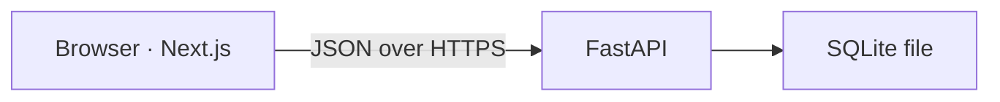
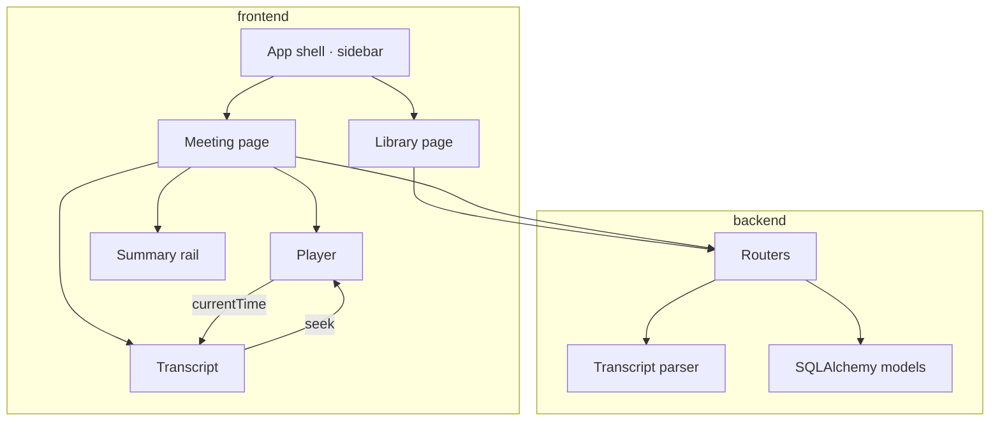

# HLD — Meeting Notes Platform (Fireflies-style)

**Status:** The original 24-hour plan. The built product is described in [STATUS.md](./STATUS.md).  
**Depends on:** [PRD](./PRD.md) and the [assignment](https://docs.google.com/document/d/1G0OGs33Izknq7K2O2bkXhykaN0AMZwbFX-5n0QeFzKk/edit)  
**Stack:** Next.js (TypeScript) · FastAPI · SQLite

This design is sized to the deadline. The grade is functionality, visual similarity, schema, API shape, and whether you can explain the code. Anything that does not serve those five is out of this build.

## 1. What the 24 hours are for

A reviewer opens one URL and can do all of this on persisted data:

1. Browse seeded meetings and narrow them by title, participant, or date.
2. Open a meeting and see transcript, summary, topics, and action items together.
3. Click a transcript line and land the player on that time. Scrubbing highlights the matching line.
4. Search inside the transcript and see the hits marked.
5. Create a meeting from a form, a paste, or a `.txt` / `.vtt` / `.json` upload.
6. Edit title and participants, change action items, delete the meeting, refresh, and see the same state.

The risky piece is step 3. It is scheduled early and protected. Visual polish and the README come after it works. Bonus features start only if deploy is already done.

## 2. Time budget

| Block | Hours | Done when | If it slips |
|---|---|---|---|
| 0. Both apps boot, models, CORS, health | 2 | `GET /health` and an empty DB file exist | |
| 1. API: list, detail, create, parse, update, delete, action items | 4 | curl can do the CRUD flows | Steal time from the visual pass, never from this |
| 2. Seed (4 meetings) + one sample audio file | 1.5 | Library is useful before the UI is pretty | |
| 3. Library screen | 3 | Search, date filter, recency sort, empty state | |
| 4. Player + transcript sync + in-transcript search | 5 | Click, scrub, and search all work | This block does not get cut |
| 5. Summary rail, action items, create/edit/delete, toasts | 3 | Capture and remove flows work after refresh | |
| 6. Visual pass toward Fireflies | 3 | Sidebar, list rows, right rail, bottom player read as that product | First place to cut |
| 7. README + deploy | 2.5 | Public repo layout and a live URL | Last hour is reserved for this |

There is no spare block. LLM summaries, comments, export, tags, dark mode, and “ask about this meeting” are bonuses and start only after block 7.

## 3. System shape



One frontend process, one backend process, one database file. The browser calls FastAPI directly (`NEXT_PUBLIC_API_URL`). Meeting data is loaded and mutated from the client, because every important interaction (seek, checkbox, toast) happens after the page is open.

The transcript clock lives in the browser. The server stores `start_seconds`. It does not stream playback.



## 4. Decisions

### FastAPI, SQLAlchemy, SQLite file

FastAPI is the backend. The assignment allows Django as well. FastAPI keeps the API as a small set of Pydantic contracts, which is what the API-design criterion is scoring. Django’s admin and auth would go unused: the brief says to assume a logged-in user and to build our own UI.

Schema lives in SQLAlchemy models. On startup the app creates tables and seeds them when the meetings table is empty. Alembic is a reasonable later step and a poor use of the first day: one developer, one SQLite file, no production migration history to preserve.

### A user row, and no login

`users` has one seeded row (name, email). Every meeting has `user_id`. The API always uses that row. Profile in the sidebar reads `GET /me`. Settings is a static placeholder page. There is no password, session, or JWT. The row exists so ownership is a real foreign key, which is the schema the brief asks you to design.

### One detail payload

`GET /meetings/{id}` returns the meeting, participants, segments, summary, topics, and action items. The meeting page always renders those together. Separate resources would add loading states and no capability.

The library endpoint does not return segments.

### Speaker label and participant are different

A participant is a person attached to the meeting (the faces on the row and in the header). A transcript line has a speaker string. Those overlap in the seed data and are not the same table. Filtering the library by participant joins `participants`. Rendering a line reads `speaker_name`. Forcing every utterance through the participant table makes upload parsing and “Speaker 2” labels harder than the brief requires.

### Client-side active line

A meeting in this demo is tens of lines, not tens of thousands. The page loads them once. The active line is the last segment whose `start_seconds` is less than or equal to the player time, found with a binary search in a pure function. A server round trip on each `timeupdate` would not make the sync more correct.

### Summaries are stored text

Seed data includes the summary, topics, and action items. Create can also send them. The UI does not call an LLM. The brief allows seeded or mocked summaries, and a live model adds a key, a failure mode, and latency on the path that has to work in the demo.

### Sample audio, timestamps inside that file

One short audio file lives in `frontend/public/sample.mp3`. Seeded meetings point at `/sample.mp3`. Their segment times fall inside that file’s duration, so click-to-seek and scrub-to-highlight are real, not a fake clock beside a dead widget. The visible range of the bar is the audio duration. No waveform analysis. A styled range input is the player.

### Strict transcript formats

Paste and upload share one parser.

| Format | Accepted shape |
|---|---|
| json | `[{"speaker","start","text","end?"}]`. `start` is seconds. `start_seconds` is also accepted. |
| vtt | `WEBVTT` cues. Time range becomes start/end. If the cue text begins with `Name:`, that name is the speaker. Otherwise the speaker is `Speaker`. |
| txt | One line per turn: `[mm:ss] Name: text` or `[hh:mm:ss] Name: text`. |

Anything else returns 400 with a message that restates these shapes. The create modal shows the same hint. A best-effort parser of arbitrary notes will burn the day and still fail the demo.

### Library query is server-side, transcript search is not

`GET /meetings` filters with SQL: title or participant name contains `q` (case-insensitive), `started_at` is inside an optional inclusive date range, order is `started_at` descending by default. `LIKE` is enough for a few dozen rows. Transcript search runs on the lines already on the page: split on the query, wrap hits in `mark`, next/previous moves between them. While a hit is selected, auto-scroll follows the hit, not the playhead.

### Refetch after writes

After create, update, delete, or an action-item change, the client refetches. There is one user and small payloads. Optimistic updates are extra code on a path that does not need them.

### Where it is hosted

The frontend goes to Vercel. The API goes to a long-running host (Render or Railway) with the SQLite file on disk. Vercel serverless will not keep a SQLite file across requests, so the API cannot live there.

`DATABASE_PATH` chooses the file. On a host whose disk survives restarts, point it at that disk. On a host that wipes disk on redeploy, seed-on-empty still brings the demo back. The README states that user-created meetings live on that disk.

CORS allows the frontend origin only.

## 5. Data model

```mermaid
erDiagram
  users ||--o{ meetings : owns
  meetings ||--o{ meeting_participants : has
  participants ||--o{ meeting_participants : attends
  meetings ||--o{ transcript_segments : contains
  meetings ||--o| summaries : has
  meetings ||--o{ topics : has
  meetings ||--o{ action_items : has

  users {
    int id PK
    string name
    string email
  }
  meetings {
    int id PK
    int user_id FK
    string title
    datetime started_at
    int duration_seconds
    string audio_path
    datetime created_at
    datetime updated_at
  }
  participants {
    int id PK
    string name
  }
  meeting_participants {
    int meeting_id PK_FK
    int participant_id PK_FK
  }
  transcript_segments {
    int id PK
    int meeting_id FK
    string speaker_name
    float start_seconds
    float end_seconds
    string text
    int position
  }
  summaries {
    int id PK
    int meeting_id FK_UNIQUE
    string body
  }
  topics {
    int id PK
    int meeting_id FK
    string title
    float start_seconds
    int position
  }
  action_items {
    int id PK
    int meeting_id FK
    string text
    bool is_done
    int position
  }
```

Rules:

- Deleting a meeting deletes its segments, summary, topics, action items, and join rows. Participants remain; they are reusable by name.
- Names match case-insensitively when linking participants. “Ava” and “ava” are one person.
- `duration_seconds` is what the library shows. On create, if the client omits it, it becomes the last segment’s end, or start if end is missing.
- `position` is the display order. `start_seconds` is the clock. They usually agree; order does not have to be recomputed from time.
- Indexes: `(user_id, started_at)` on meetings, `(meeting_id, position)` and `(meeting_id, start_seconds)` on segments.

Integer primary keys. They are easier to trace in a one-day demo than UUIDs.

## 6. API

Base path `/api`. Errors use FastAPI’s `{"detail": "..."}`. The client toasts `detail`.

| Method | Path | Body / query | Returns |
|---|---|---|---|
| GET | `/api/health` | | `{ "ok": true }` |
| GET | `/api/me` | | the default user |
| GET | `/api/meetings` | `q`, `from`, `to` (`YYYY-MM-DD`), `sort=recent\|oldest` | meeting cards: id, title, started_at, duration_seconds, participants |
| POST | `/api/meetings` | JSON below | the detail payload, 201 |
| POST | `/api/meetings/import` | multipart file + optional title, started_at, participant_names | detail payload, 201 |
| GET | `/api/meetings/{id}` | | detail payload, or 404 |
| PATCH | `/api/meetings/{id}` | title, started_at, duration_seconds, participant_names | detail payload |
| DELETE | `/api/meetings/{id}` | | 204 |
| POST | `/api/meetings/{id}/action-items` | `{ "text" }` | the item |
| PATCH | `/api/action-items/{id}` | `text`, `is_done` | the item |
| DELETE | `/api/action-items/{id}` | | 204 |

Create body:

```json
{
  "title": "Roadmap review",
  "started_at": "2026-10-01T15:00:00Z",
  "duration_seconds": 240,
  "participant_names": ["Ava Shah", "Noah Kim"],
  "transcript_format": "txt",
  "transcript_text": "[00:12] Ava Shah: ...",
  "summary": "optional paragraph",
  "topics": [{ "title": "Timeline", "start_seconds": 40 }],
  "action_items": [{ "text": "Send the revised dates" }]
}
```

`transcript_text` may be omitted (blank meeting). `summary`, `topics`, and `action_items` may be omitted.

Detail payload:

```json
{
  "id": 1,
  "title": "Roadmap review",
  "started_at": "2026-10-01T15:00:00Z",
  "duration_seconds": 240,
  "audio_path": "/sample.mp3",
  "participants": [{ "id": 1, "name": "Ava Shah" }],
  "summary": { "body": "..." },
  "topics": [{ "id": 1, "title": "Timeline", "start_seconds": 40, "position": 0 }],
  "action_items": [{ "id": 1, "text": "Send the revised dates", "is_done": false, "position": 0 }],
  "segments": [
    { "id": 1, "speaker_name": "Ava Shah", "start_seconds": 12, "end_seconds": 28, "text": "...", "position": 0 }
  ]
}
```

List results are capped at 100. The seed is far under that. Pagination UI is unnecessary at this size.

Summary and topics have no edit endpoints. The brief asks to edit title and participants, and to add, edit, and complete action items. Adding summary editing would be a second form on the critical screen.

Replacing participants on PATCH rewrites the join rows for that meeting and leaves other meetings alone.

## 7. Screens

Same shell on every page: left sidebar about 240px wide, white, product name on top.

Sidebar items:

- **Meetings** — the library. This is the home route `/`.
- **Uploads, Integrations, Analytics** — visible, disabled, labeled coming soon. They are the Fireflies nav, and the brief says a coming-soon treatment is enough.
- **Settings** — `/settings`, a short placeholder.
- **Profile** at the bottom — name and email from `GET /me`. The menu does not need to open.

Library (`/`):

- Title “Meetings” and a primary “Add meeting” button.
- Search box. Query string `q`, `from`, `to`, `sort` so refresh keeps the filter.
- Date fields and a newest/oldest control.
- Rows: title, date, duration, initials for participants. The whole row opens `/meetings/{id}`.
- Empty filter result is a sentence and a clear-filters action, not a blank pane.

Meeting (`/meetings/{id}`):

- Header: title, date, duration, participant initials, Edit, Delete.
- Main column: transcript search (query, count, previous, next), then the lines. Each line is speaker, `mm:ss`, text.
- Right rail, about 360px: summary, topics, action items. A topic with `start_seconds` seeks the player.
- Player pinned to the bottom of the page: play/pause, range, current time, duration.

Create and edit are modals, not extra routes. Delete asks for confirmation in a modal, then returns to `/`.

Settings (`/settings`): the shell plus a short “Coming soon” panel.

Visual target, in this order if time gets tight: sidebar, meeting rows, two-column meeting page, purple accent on the active nav item and primary button, bottom player. Pixel-matching Fireflies beyond that is block 6, and block 6 is the one that yields.

## 8. Player and transcript behavior

`activeSegmentIndex(segments, timeSeconds)` is a pure function:

- Sort is already `position`, and seed data is also ordered by `start_seconds`.
- Return the greatest index with `start_seconds <= timeSeconds`.
- Return `-1` when the playhead is before the first line.

The audio element’s `timeupdate` writes `currentTime` into React state. The line at that index gets the active style. When the index changes, that line scrolls into view, unless transcript search currently owns the scroll.

Clicking a line sets `audio.currentTime` to that line’s `start_seconds` and plays.

Search:

- Case-insensitive substring.
- Every match is wrapped in `mark`.
- Previous/next cycles a match index and scrolls that mark into view.
- An empty query clears marks.

This function is worth one small test. The txt/vtt/json parser is worth one small pytest. Those are the only tests in the 24 hour plan. A failing sync or a rejected upload is a failed demo; a missing component test is not.

## 9. Backend layout

```text
backend/
  app/
    main.py              # app, CORS, create_all, seed, routers
    database.py          # engine, session
    models.py
    schemas.py
    seed.py
    routers/meetings.py
    routers/action_items.py
    services/transcript_parser.py
  requirements.txt
```

`fireflies.db` is gitignored. Tests can use a temp file.

## 10. Frontend layout

```text
frontend/
  app/
    layout.tsx                 # sidebar shell
    page.tsx                   # library
    meetings/[id]/page.tsx
    settings/page.tsx
  components/
    Sidebar.tsx
    MeetingList.tsx
    CreateMeetingModal.tsx
    EditMeetingModal.tsx
    DeleteMeetingDialog.tsx
    Transcript.tsx
    Player.tsx
    SummaryRail.tsx
  lib/
    api.ts
    activeSegment.ts
    formatTime.ts
  public/
    sample.mp3
```

Tailwind for layout. A single toast helper (a few lines of context, or the `sonner` package) covers success and failure. No global state library. Page-level state plus the URL query on the library is the whole client model.

## 11. Seed

Four meetings, shared audio path, timestamps inside the sample:

| Meeting | Why it is in the seed |
|---|---|
| Q4 roadmap review | Long enough to show scroll, topics that seek, several action items |
| Acme discovery call | Different participants, so name search is obvious |
| Sprint retro | Overlaps one participant with the roadmap review |
| Design critique | Shorter, with a completed action item |

Each has a multi-sentence summary, at least three topics, and at least three action items. One action item in the seed is already done, so the checkbox state is visible before anyone clicks.

## 12. What this build will not contain

| Item | Reason |
|---|---|
| Live bot, speech-to-text, Zoom, calendar, CRM, teams | The brief says a coming-soon label is enough |
| Login | The brief says to assume a user |
| LLM summary or ask-the-meeting | Seeded text already meets the criterion |
| Summary/topic editing | Not in the required CRUD |
| Waveform, comments, export, tags, dark mode, global search | Bonus. Export to Markdown is the only one worth adding, and only after the live URL works |
| Pagination, full-text engine, queues, cache, websockets | The data does not need them |

## 13. Demo failure modes to design against

- **Playhead and line disagree.** Keep the rule in one function and test it: last segment with `start <= time`.
- **Upload “succeeds” and shows no lines.** Parser returns 400 instead of storing an empty transcript with 201. The toast shows the expected format.
- **Created meeting vanishes on the hosted API.** Seed on empty database, and document that new rows persist only where `DATABASE_PATH` points.
- **The UI looks like a generic admin table.** Ship the sidebar and the right rail before tuning colors. Those two regions are what make it read as Fireflies.
- **Scope slips into a bonus.** Bonuses are blocked until block 7 in the time budget is done.

## 14. How to explain it

- The UI and the API are separate processes because the brief requires `frontend/` and `backend/`, and because playback state is a client clock over stored timestamps.
- The active line is computed locally because the transcript is already loaded and the list is small.
- Participants and speaker labels are different relations: one is who was in the meeting, the other is the name printed on a line.
- The meeting page uses one GET because it always draws every panel.
- Auth is a seeded user row and no credentials, matching the brief.
- FastAPI is there so the routes and schemas stay small enough to walk through in the evaluation.
